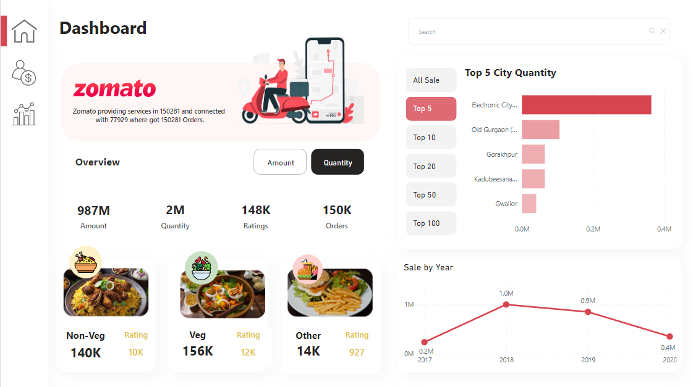
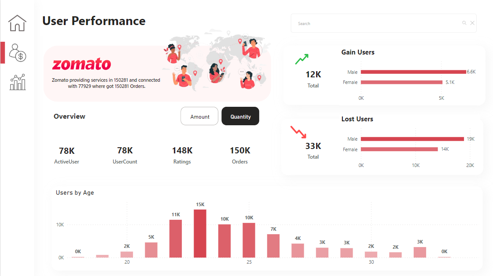
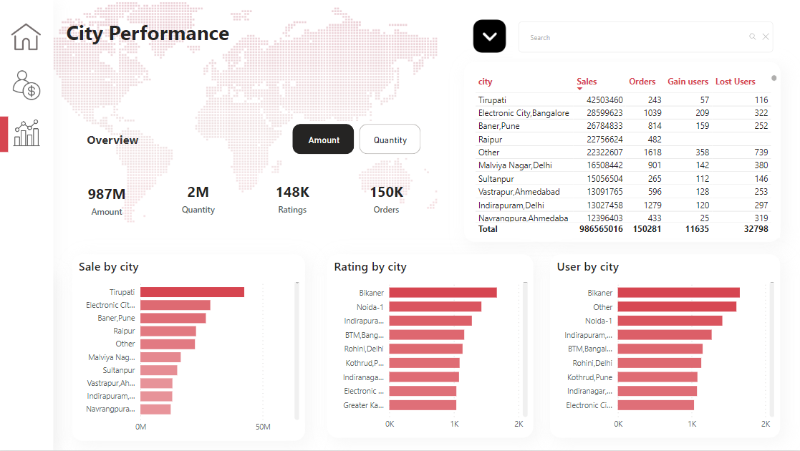

# Zomato Sales Dashboard

Zomato is a food delivery app, and the Zomato Sales Dashboard provides comprehensive insights into its sales performance and user behavior.

## Access Dashboard

Access the Zomato Sales Dashboard [here](https://app.powerbi.com/view?r=eyJrIjoiZWY4ZGZjNDItNjhkMi00ODI3LTkzNzEtZTljZjZmZDRmOGI3IiwidCI6ImM2ZTU0OWIzLTVmNDUtNDAzMi1hYWU5LWQ0MjQ0ZGM1YjJjNCJ9&pageName=ReportSection942577546b22383670da).

## Dashboard Pages

### Overview

- Metrics: Total Amount, Quantity, Ratings, Orders
- Segmentation based on veg or non-veg food
- Top city chart with options to select top cities based on amount or quantity

### User Performance

- Metrics: Active Users, User Count, Ratings, Orders
- Visuals for gained users (male and female) and lost users (male and female)
- Visual for users by age

### City Performance

- Metrics: Amount, Quantity, Ratings, Orders
- Visuals for sales, ratings, and users by city
- Matrix visual showing all cities with sales, orders, gained users, and lost users

## About Power BI

Power BI is a powerful business analytics tool by Microsoft that allows users to visualize and analyze data from various sources. It provides interactive dashboards and reports, enabling data-driven decision-making.

## Power BI Documentation

For more information about Power BI and its features, refer to the [official documentation](https://docs.microsoft.com/en-us/power-bi/).

## Contact

If you have any queries or bugs to report, feel free to reach out to me on [LinkedIn](https://www.linkedin.com/in/pratheekpshenoy/).

